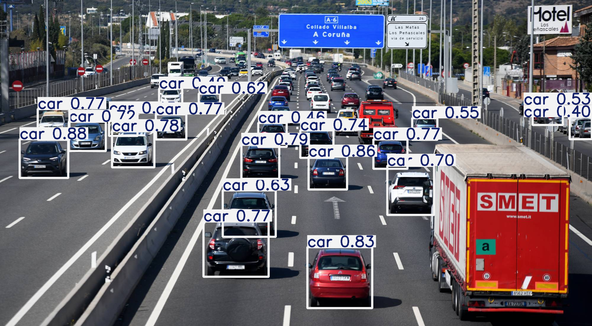
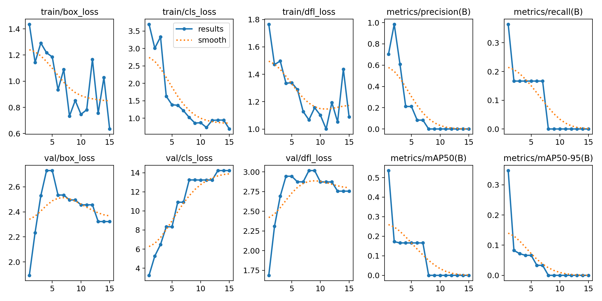

# YOLOv8 Vehicle Detection: Optimización para Entornos Ligeros 🚀


## 📌 Descripción del Proyecto
Este proyecto consiste en la implementación y validación de un sistema de detección de objetos utilizando **YOLOv8 Nano**. La investigación se centra en la eficiencia computacional, buscando un modelo capaz de ejecutarse en dispositivos con recursos limitados (Edge Computing/Raspberry Pi) sin sacrificar la fiabilidad en la detección de tráfico urbano.

Este trabajo sirve como **Prueba de Concepto (PoC)** y base técnica para mi futuro Trabajo de Fin de Máster (TFM) sobre monitorización inteligente de infraestructuras viales.

---

## 📸 Resultados de Inferencia
El modelo ha sido probado con imágenes de tráfico real, logrando identificar múltiples clases simultáneamente con una latencia mínima.



---

## 📊 Análisis de Métricas y Rendimiento
A diferencia de otros proyectos, aquí se prioriza la interpretación técnica de los resultados sobre la búsqueda de números "perfectos".

### Métricas obtenidas:
* **Precisión (P):** 87.1%
* **mAP50:** 0.523 (Tras 15 épocas de entrenamiento)



### 💡 Lecciones Aprendidas (Insight Técnico)
El entrenamiento se realizó sobre un subset del dataset **COCO8**. El mAP obtenido del 52.3% indica un escenario de **overfitting controlado**. Esta observación es clave: demuestra que el modelo ha aprendido las características principales pero requiere de un dataset más extenso (como *Cityscapes*) para mejorar su capacidad de generalización, objetivo marcado para la siguiente fase del proyecto.

---

## 🛠️ Tecnologías Utilizadas
* **Arquitectura:** YOLOv8n (Nano) de Ultralytics.
* **Preprocesamiento:** OpenCV (Normalización y filtrado de imágenes).
* **Entorno:** Google Colab / Python 3.x.

---

## 🚀 Cómo ejecutarlo
1. Clona este repositorio:
   ```bash
   git clone [https://github.com/Yushetf33/Deteccion-de-vehiculos-con-YOLOv8-Nano(https://github.com/Yushetf33/Deteccion-de-vehiculos-con-YOLOv8-Nano.git)
